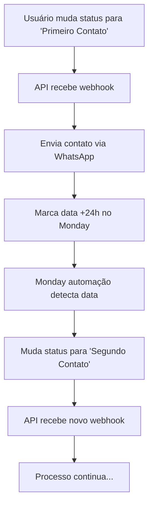

# 🤖 Configuração das Automações Monday.com

## Como Configurar as Automações para a Nova Abordagem

### 📋 Pré-requisitos

1. ✅ Webhook da API configurado no Monday.com
2. ✅ Board CRM com as colunas:
   - `Contato SDR Realizado` (status column)
   - `Próximo ctt` (date column)
3. ✅ API CRM rodando e conectada

### 🎯 Automações Necessárias

#### Automação 1: Primeiro → Segundo Contato
```
QUANDO:
- Coluna "Próximo ctt" = Data de hoje
- E Status "Contato SDR Realizado" = "Primeiro Contato"

ENTÃO:
- Mudar "Contato SDR Realizado" para "Segundo Contato"
```

#### Automação 2: Segundo → Terceiro Contato  
```
QUANDO:
- Coluna "Próximo ctt" = Data de hoje
- E Status "Contato SDR Realizado" = "Segundo Contato"

ENTÃO:
- Mudar "Contato SDR Realizado" para "Terceiro Contato"
```

#### Automação 3: Terceiro → Último Contato
```
QUANDO:
- Coluna "Próximo ctt" = Data de hoje
- E Status "Contato SDR Realizado" = "Terceiro Contato"

ENTÃO:
- Mudar "Contato SDR Realizado" para "Ultimo Contato"
```

#### Automação 4: Finalização da Sequência
```
QUANDO:
- Status "Contato SDR Realizado" = "Ultimo Contato"
- E Coluna "Próximo ctt" está vazia

ENTÃO:
- Mudar "Contato SDR Realizado" para "Não Respondeu"
```

### 📋 Passo a Passo para Configurar

#### 1. Acesse Automações
- No seu board CRM, clique em "Automate" (ícone de raio)
- Clique em "Create Automation"

#### 2. Configure Automação 1
1. **Trigger (Quando):**
   - Escolha "Date arrives" 
   - Selecione coluna "Próximo ctt"
   - Adicione condição: "Status" = "Primeiro Contato"

2. **Action (Então):**
   - Escolha "Change Status"
   - Selecione coluna "Contato SDR Realizado"
   - Defina novo status: "Segundo Contato"

3. **Ative a automação**

#### 3. Repita para as Outras Automações
- Configure as automações 2, 3 e 4 seguindo o mesmo padrão
- Cada uma com sua condição específica

### ⚙️ Configurações Importantes

#### Timing das Automações
- **Frequência**: Configure para verificar a cada hora
- **Horário**: Durante horário comercial (9h às 18h)
- **Dias**: Segunda a sexta

#### Condições Múltiplas
- Use "AND" entre as condições
- Certifique-se que ambas as condições sejam atendidas

### 🧪 Como Testar as Automações

#### Teste Manual
1. **Crie um item no board**
2. **Defina status "Primeiro Contato"**
3. **Defina data "Próximo ctt" para hoje**
4. **Aguarde a automação executar** (pode demorar alguns minutos)

#### Monitoramento
- Verifique se o status mudou automaticamente
- Confira se disparou o webhook da nossa API
- Acompanhe os logs da aplicação

### 🔍 Verificação das Automações

#### No Monday.com
- Acesse "Automate" → "Activity Log"
- Verifique se as automações estão sendo executadas
- Confirme se não há erros

#### Na API CRM
```bash
# Verificar logs em tempo real
curl http://localhost:3001/api/logs/detailed
```

#### Webhook Logs
- Monitore webhooks sendo recebidos
- Confirme se contatos estão sendo enviados
- Verifique se datas +24h estão sendo marcadas

### 📈 Fluxo Esperado



### ⚠️ Troubleshooting

#### Automação Não Executa
- Verifique se está ativada
- Confirme se as condições estão corretas
- Teste com data passada primeiro

#### Webhook Não Dispara
- Verifique URL do webhook no Monday
- Confirme se API está rodando
- Teste manualmente o endpoint

#### Datas Incorretas
- Verifique fuso horário
- Confirme cálculo de horário comercial
- Teste cálculo de data

### 📊 Dashboard de Monitoramento

Acesse: `http://localhost:3001/dashboard`

Monitore:
- ✅ Status das conexões
- 📋 Logs em tempo real  
- 📈 Estatísticas de disparo
- 🔔 Alertas de erros

### 🎯 Próximos Passos

1. ✅ Configure as 4 automações
2. 🧪 Teste com um lead real
3. 👀 Monitore por 24h
4. 📈 Valide sequência completa
5. 🚀 Ative para todos os leads

---

**Criado em:** ${new Date().toLocaleString('pt-BR', { timeZone: 'America/Sao_Paulo' })}
**Status:** Nova abordagem implementada ✅
